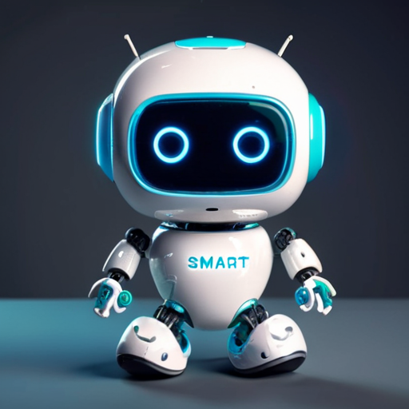

# AI Telegram Bot

<p align="center">
 
</p>


**ai-telegram-bot** is a Telegram bot powered by AI to provide interesting interactions, Ollama conversations, and image processing capabilities.

## Table of Contents

- [Introduction](#introduction)
- [Features](#features)
- [Getting Started](#getting-started)
- [Usage](#usage)
- [Type of messages](#type-of-messages)
- [Dependencies](#dependencies)

## Introduction

This Telegram bot integrates advanced AI capabilities to make your conversations more engaging and provides powerful voice and image processing features. The bot utilizes the Ollama handler for fun text interactions and incorporates YOLO (You Only Look Once) model for image processing.

## Features

- Ollama Conversations: Engage in amusing and creative text conversations with Ollama, the AI-powered chat handler.
- Voice Processing: Transcribe text from voice messages and interact with Ollama using the transcribed text.
- Image Processing: Upload images for processing through YOLO model, and receive the analyzed image back.

## Getting Started

1. Clone the repository:

```bash
git clone https://github.com/serghidalg/ai-telegram-bot.git
cd ai-telegram-bot
```
2. Install dependencies:
```bash
pip install -r requirements.txt
```
3. Obtain a Telegram Bot Token from [Bot Father](https://telegram.me/BotFather) and add it to the `variables.py` file.
4. Run the program
```bash
python telegram_bot.py
```
5. In your chat write /start and add the code to the `variables.py` list.
6. Set other variables for [Ollama](https://github.com/jmorganca/ollama) to work and you are all set!

## Usage
Run the bot using:
```bash
python telegram_bot.py
```
The bot will be ready to respond to your commands and process voice and image messages.

## Type of messages

- /start to initialize the bot
- TEXT: it will be answered by Ollama AI.
- AUDIO: will be transcribed and sent to Ollama.
- IMAGE: YOLO will perform image classification on it.


Send a voice message to have it transcribed. Ollama will then respond based on the transcribed text.
Image Processing

## Dependencies

    Telebot
    Whisper
    Pydub
    Ultralytics
    Pillow (PIL)
